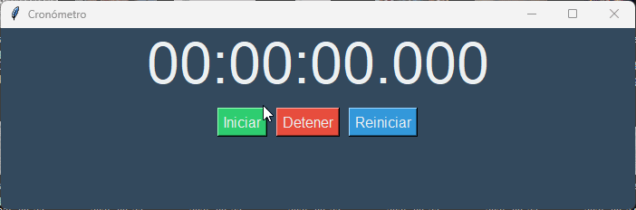

⏱️ Cronómetro en Python
Un cronómetro moderno y funcional creado con Python y la librería Tkinter, con un diseño limpio y botones interactivos para iniciar, detener y reiniciar el tiempo.

---

## ✨ Vista previa


---

## 🚀 Características

Interfaz gráfica con Tkinter
Muestra horas, minutos, segundos y milisegundos

---

## 📊 Lenguajes y Herramientas

[](https://skillicons.dev)


---

## 🚀 Botones de control:

🟢 Iniciar: comienza la cuenta
🔴 Detener: pausa el cronómetro
🔵 Reiniciar: vuelve a cero

Diseño moderno con colores personalizados
Ventana adaptable y centrada

---

## 🧩 Requisitos
Python 3.7 o superior
Librería estándar tkinter (viene incluida con Python)
Verifica si Tkinter está instalado ejecutando en tu terminal:

python -m tkinter

---

## 🚀 Cómo usarlo localmente

1. Clona el repositorio:
   ```bash
    git clone https://github.com/jcduro/Cronometro_Python.git
    cd Cronometro_Python
